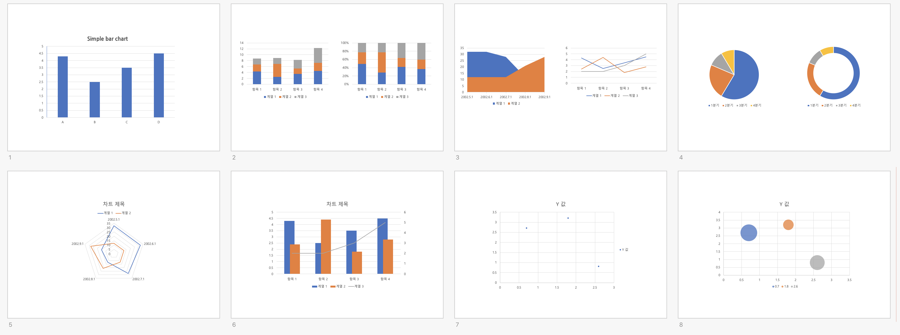
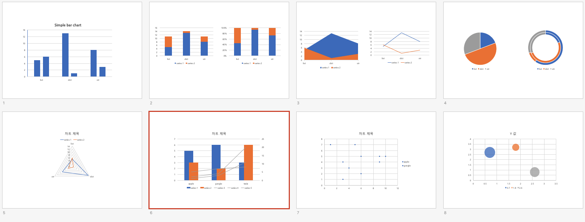

# How to use it?

## make master pptx
[link how to make master pptx](#)

### master.pptx preview


## make page!
create `slide.json`

## make ppt!
```shell script
pptt make_ppt master.pptx clone.pptx -i slide.json
```

### clone.pptx preview


p.s. combo chart is not work very well...
I will fix ASAP!