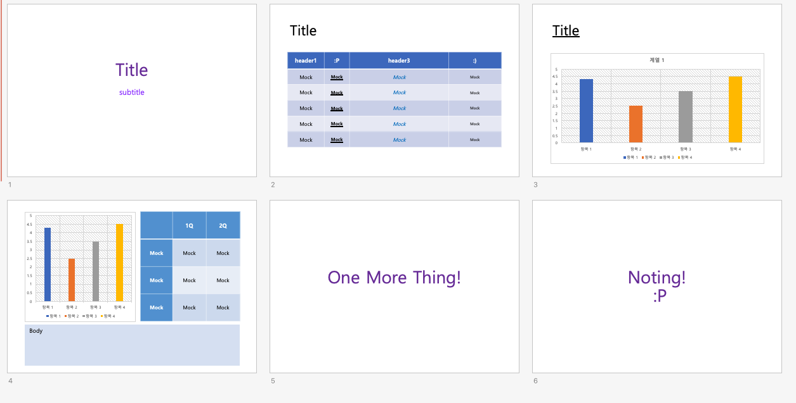
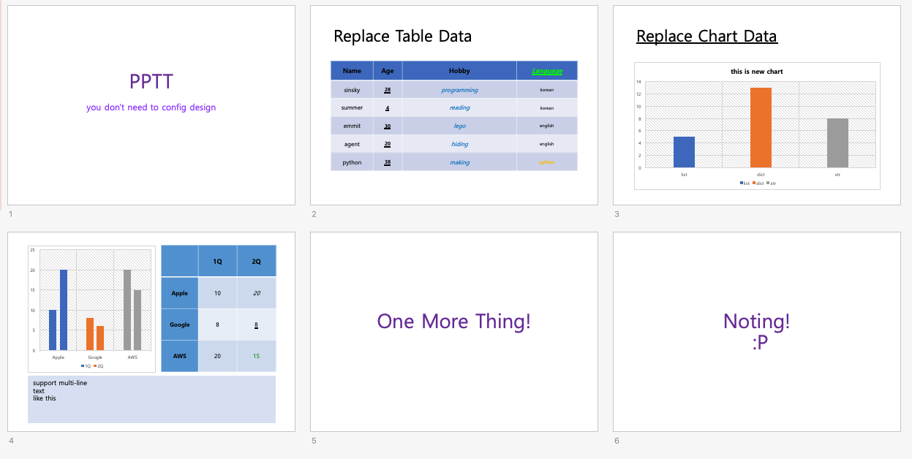

# How to use it?

## make master pptx
[link how to make master pptx](#)

### master.pptx preview


## make page!
create `slide.json` like this
```json
{
  "pages": [
    {
      "slide_pos": 1,
      "contents": {
        "title": {
          "text": "PPTT"
        },
        "subtitle": {
          "text": "you don't need to config design"
        }
      }
    },
    {
      "slide_pos": 2,
      "contents": {
        "title": {
          "text": "Replace Table Data"
        },
        "table": {
          "table": {
            "data_type": "key_value",
            "keys": [
              "Name",
              "Age",
              {
                "name": "Hobby",
                "data_key": "hobby"
              },
              {
                "name": {
                  "value": "Language",
                  "font": {
                    "bold": true,
                    "italic": true,
                    "underline": true,
                    "color": "#00F900"
                  }
                },
                "data_key": "language"
              }
            ],
            "data": [
              {"Name": "sinsky", "Age": 28, "hobby": "programming", "language": "korean"},
              {"Name": "summer", "Age": 4, "hobby": "reading", "language": "korean"},
              {"Name": "emmit", "Age": 30, "hobby": "lego", "language": "english"},
              {"Name": "agent", "Age": 20, "hobby": "hiding", "language": "english"},
              {
                "Name": "python",
                "Age": 38,
                "hobby": "making",
                "language": {
                  "value": "python",
                  "font": {
                    "bold": true,
                    "color": "#FFC107"
                  }
                }
              }
            ]
          }
        }
      }
    },
    {
      "slide_pos": 3,
      "contents": {
        "title": {
          "text": "Replace Chart Data"
        },
        "chart": {
          "chart": {
            "data_type": "category_data",
            "title": "this is new chart",
            "categories": ["list", "dict", "str"],
            "series": {
              "series 1": [5, 13, 8]
            }
          }
        }
      }
    },
    {
      "slide_pos": 4,
      "contents": {
        "body": {
          "text": "support multi-line\ntext\nlike this"
        },
        "table": {
          "table": {
            "data_type": "raw",
            "data": [
              [null, "1Q", {"value": "2Q", "font": {"bold": true}}],
              ["Apple", 10, {"value": 20, "font": {"italic": true}}],
              ["Google", 8, {"value": 8, "font": {"underline": true}}],
              ["AWS", 20, {"value": 15, "font": {"color": "00F900"}}]
            ]
          }
        },
        "chart": {
          "chart": {
            "data_type": "category_data",
            "categories": ["Apple", "Google", "AWS"],
            "series": {
              "1Q": [10, 8, 20],
              "2Q": [20, 6, 15]
            }
          }
        }
      }
    }
  ]
}

```

## make ppt!
```shell script
pptt make_ppt master.pptx clone.pptx -i slide.json
```

### clone.pptx preview
