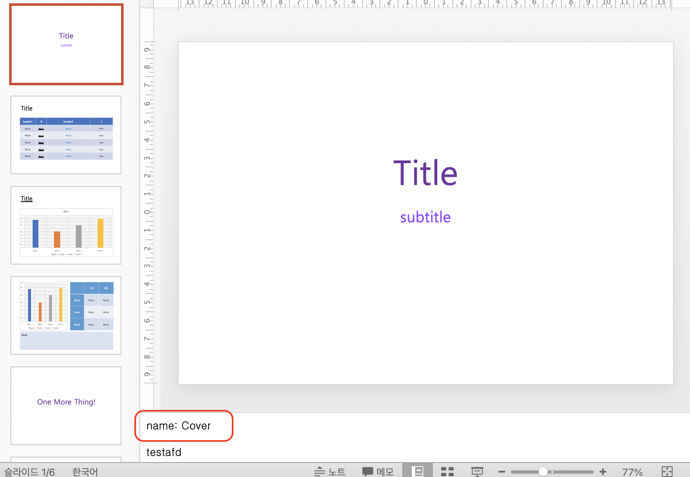

# How to set stub alias?

If you write `name: <name>` in your slide note, 
it creates a class with that name when you create a stub.
Nicknamed stub helps you program flexibly when repositioning slides in the future.



## Stub Result
```python
@dataclass
class Slide1Content():
    title: Optional[TextData] = field(default=None)
    subtitle: Optional[TextData] = field(default=None)


@dataclass
class Slide1(SlideData):
    contents: Optional[Slide1Content] = field(default=None)
    slide_pos: int = 1


class CoverSlide(Slide1):
    pass


class CoverContent(Slide1Content):
    pass


```
